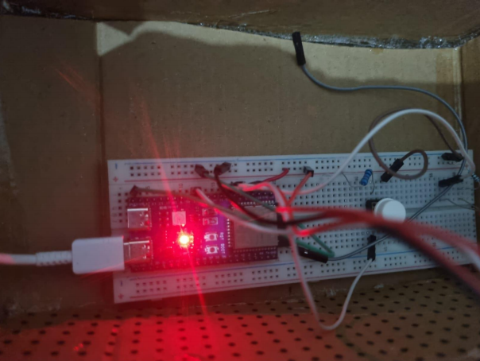
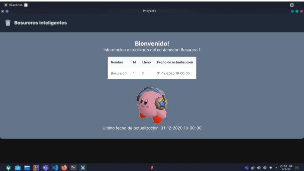
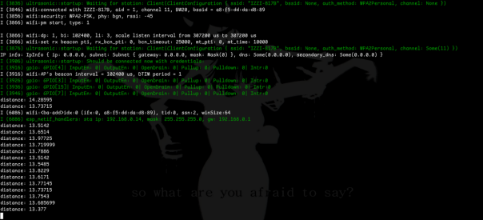
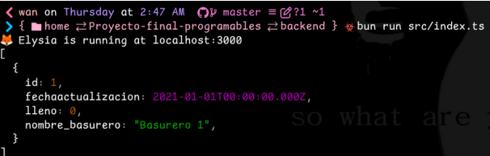
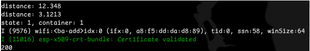
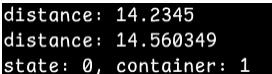
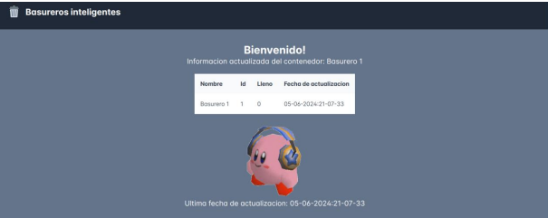

# Proyecto final Sistemas Programables

Se supone que es el proyecto final para sistemas programables, estara hecho con electron y usara el
ESP-32 para una comunicacion HTTP entre el circuito y la app de escritorio

## El comando para correr la app es:
```sh
npm run electron
```
## Comando par inicializar el docker
```sh
docker build -t postgresql-basurero .
```
## Comando para inicializar el servidor den Elyisia.
```sh
bun run src/index.ts
```


## Fotos del proyecto
### Protipo del contenedor
  

### Aplicacion desarrollada  
  

### Fotos de la aplicacion funcionando en consola
  
  
  
  
  


## Shoutout a Ramses

Siganlo en [git](https://github.com/RamMaths).  
[Repositorio](https://github.com/NexWan/iot-container) forkeado de ramses que modifique un poco para el ESP-32

